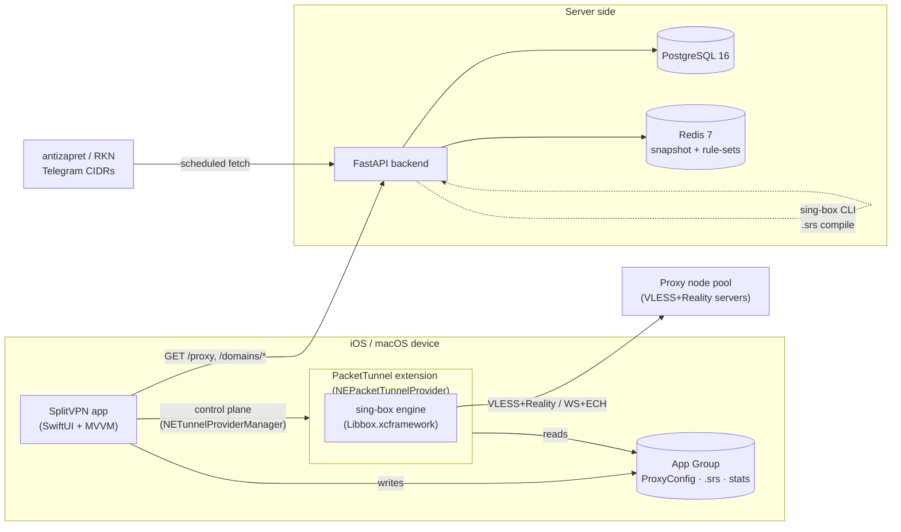

# SplitVPN

**Geo-aware split-tunneling VPN for iOS and macOS, powered by an embedded sing-box engine and a FastAPI control plane.**

Russian domains route directly for speed; everything else is transparently proxied through a self-hosted VLESS + Reality pool — with client-side server auto-rotation, DPI-resistant TLS masquerade, and a backend that keeps the blocked-domain rule-sets fresh.

<p>
  
  
  
  
  
  
  
  
  
  
  
</p>

---

## Overview

SplitVPN is a full-stack VPN product built to defeat DPI-based throttling and geo-blocking without sacrificing local-network performance. Instead of tunnelling *all* traffic, it makes a per-connection routing decision:

- **Russian resources** (`.ru`, `.рф`, `xn--p1ai`, `.su`) and private/LAN ranges go **direct** — fast, and correct for services that reject foreign IPs.
- **Everything else** is transparently routed through a **VLESS + Reality** proxy pool — automatically covering throttled or geo-blocked services (YouTube, OpenAI, etc.) with no per-site configuration.

The apps embed the **sing-box** engine via `Libbox.xcframework` inside a `NEPacketTunnelProvider` network extension. Routing, DNS splitting, TLS masquerade and failover all run inside sing-box's config. The **FastAPI backend** keeps the blocked-domain rule-sets current (compiled to sing-box binary `.srs`) and serves a health-checked catalog of proxy nodes.

> The iOS app is the primary target; the macOS app is a near-identical SwiftUI port sharing the same engine and services.

## Features

- **Geo split tunnelling** — RU-direct / rest-proxy routing decided entirely by sing-box route rules on a full-device TUN.
- **Cross-platform** — native SwiftUI apps for **iOS 16+** and **macOS 13+** sharing one engine, one config builder, and one set of services.
- **Embedded sing-box (libbox)** packet-tunnel provider — no external helper daemon; the extension runs the full proxy stack in-process under a ~45 MB memory guard tuned for the iOS NE jetsam limit.
- **VLESS + Reality** with uTLS (Chrome fingerprint) and `xtls-rprx-vision` flow; **VLESS-over-WebSocket + TLS + ECH** (Cloudflare mode) and **SOCKS5** fallbacks are also supported.
- **Client-side auto-rotation** — a sing-box `urltest` outbound group probes a pool of endpoints (multiple hosts × ports × per-port SNI fronts) and fails over to the fastest live one when DPI blocks a path — no backend round-trip required.
- **DNS split + anti-tamper** — RU domains resolve via the system resolver; foreign domains resolve over DoH (`1.1.1.1`) *through the proxy* to defeat DNS poisoning; QUIC is rejected to force a working TCP/443 fallback.
- **IP rule-sets for no-SNI services** — Telegram MTProto (which connects straight to datacenter IPs) is routed by CIDR rule-set, since domain-based split can't see it.
- **Live traffic stats** — up/down throughput, session totals and connection duration shared from the extension to the UI via an App Group.
- **Self-updating backend** — scheduled refresh of blocked-domain lists (antizapret primary, RKN/zapret-info fallback), atomic gzip snapshot in Redis, binary `.srs` compilation, and periodic TCP health checks with latency ranking of proxy nodes.

## Architecture



**Traffic path.** The app writes the selected `ProxyConfig` into a shared App Group container and starts the tunnel through `NETunnelProviderManager`. The extension boots sing-box, which builds a full-device TUN, sniffs each connection, and applies geo rules: RU/LAN → `direct`, everything else → the `urltest` proxy group. Foreign traffic exits via VLESS + Reality to a self-hosted node pool. The backend is a control plane only — it never sees user traffic; it serves the proxy catalog and the compiled domain/IP rule-sets.

## Tech Stack

| Layer | Technology |
|-------|------------|
| iOS / macOS UI | Swift 5.9, SwiftUI, MVVM, Combine |
| VPN runtime | NetworkExtension (`NEPacketTunnelProvider`), sing-box via `Libbox.xcframework` |
| On-device storage | App Group container, GRDB / SQLite, shared `UserDefaults` |
| Proxy protocols | VLESS + Reality (uTLS, xtls-rprx-vision), VLESS + WS/TLS/ECH, SOCKS5 |
| Backend API | Python 3.12, FastAPI 0.110, Uvicorn, Pydantic v2 / pydantic-settings |
| Data | PostgreSQL 16 (async SQLAlchemy 2.0 + asyncpg), Alembic migrations |
| Cache / snapshots | Redis 7 (atomic gzip domain snapshot + binary `.srs` rule-sets) |
| Scheduling | APScheduler (domain refresh, proxy health checks) |
| Rule-set build | sing-box CLI (compiles `.srs` binary rule-sets) |
| Packaging | Docker + docker-compose; XcodeGen (`project.yml`) |

## Project Structure

```
top-vpn/
├── backend/                 # FastAPI control plane
│   ├── app/
│   │   ├── api/             # domains, proxy, admin routers
│   │   ├── models/          # SQLAlchemy models (Domain, ProxyServer, UpdateLog)
│   │   ├── schemas/         # Pydantic request/response models
│   │   ├── services/        # domain_updater, proxy_checker
│   │   ├── config.py        # pydantic-settings
│   │   ├── scheduler.py     # APScheduler jobs
│   │   └── main.py          # app + lifespan + routers
│   ├── migrations/          # Alembic (0001_initial → 0003_proxy_reality)
│   ├── scripts/             # seed_proxy, create_admin
│   ├── tests/               # pytest suite
│   ├── docker-compose.yml   # db + cache + api
│   └── Dockerfile
├── frontend/                # iOS app (SwiftUI, iOS 16+)
│   ├── SplitVPN/            # App, Views, Models, Services, Support
│   ├── PacketTunnel/        # NEPacketTunnelProvider + sing-box bridge
│   ├── Shared/              # App Group, ProxyConfig, DomainStore, VPNStats
│   └── project.yml          # XcodeGen spec  (Vendor/ excluded — see note)
├── frontend_macos/          # macOS app (SwiftUI, macOS 13+) — near-identical port
├── privacy-policy/          # static privacy page
└── SplitVPN_TZ.docx         # product spec (RU)
```

## Getting Started

### Backend

```bash
cd backend
cp .env.example .env         # adjust POSTGRES_PASSWORD, JWT_SECRET, API_PORT
docker compose up --build    # starts db (Postgres), cache (Redis), api (FastAPI)
```

Alembic migrations run automatically on container start (`entrypoint.sh` → `alembic upgrade head`), then Uvicorn serves the API.

- API: `http://localhost:8080`
- Swagger UI: `http://localhost:8080/docs`
- Health: `http://localhost:8080/health`

Seed a proxy node (edit the placeholders in `scripts/seed_proxy.py` with your own VLESS + Reality server first):

```bash
docker compose exec api python -m scripts.seed_proxy
```

Force an initial blocked-domain fetch and rule-set build:

```bash
curl -X POST http://localhost:8080/admin/domains/refresh
```

### iOS / macOS apps

1. **Provide the vendored engine (required):** place `Libbox.xcframework` at `frontend/Vendor/Libbox.xcframework` (and `frontend_macos/Vendor/…`). See the note below.
2. Generate the Xcode project from the XcodeGen spec if needed: `xcodegen generate` (or open the existing `SplitVPN.xcodeproj`).
3. Open `SplitVPN.xcodeproj`, set your Team ID and provisioning for the app **and** the `PacketTunnel` extension (both need the App Group `group.com.splitvpn.app` and the `packet-tunnel-provider` entitlement).
4. In `SplitVPN/Support/AppConfig.swift`, replace the placeholder backend host and proxy pool with your own values (real production values were removed for open-sourcing).
5. Build and run on a device (the packet-tunnel extension does not run on the iOS Simulator).

> **NOTE — vendored frameworks are excluded from this repository.**
> The prebuilt `Vendor/` directory (notably **`Libbox.xcframework`**, the sing-box mobile binding) is intentionally **not committed** — it is a large binary artifact and is referenced but absent here. Every `import Libbox` will fail to compile until you supply it. Build/obtain the sing-box `libbox` xcframework (the sing-box-for-apple toolchain produces it) and drop it into `frontend/Vendor/` and `frontend_macos/Vendor/`. The GRDB dependency resolves normally via Swift Package Manager.

## API Overview

All endpoints are currently **public** (the earlier JWT auth layer was removed for this build — see Status).

| Method | Path | Purpose |
|--------|------|---------|
| `GET`  | `/health` | Liveness + Redis ping |
| `GET`  | `/proxy/list` | Active, non-expired proxy nodes (ordered by region) |
| `GET`  | `/proxy/best` | Lowest-latency active node (fallback: any active) |
| `GET`  | `/domains/list` | Paginated blocked-domain list (debug/admin) |
| `GET`  | `/domains/export` | Full domain list as one atomic gzip snapshot |
| `GET`  | `/domains/export.srs` | Precompiled binary sing-box domain rule-set |
| `GET`  | `/domains/export-ip.srs` | Binary IP rule-set (Telegram CIDRs, no-SNI services) |
| `GET`  | `/domains/updated_at` | Last update timestamp + domain count |
| `POST` | `/admin/domains/refresh` | Force domain-list refresh from sources |
| `POST` | `/admin/proxy/add` | Register a new proxy node |

Binary `.srs` rule-sets are served precompiled because parsing ~127k domains from JSON on-device would blow the extension's ~50 MB memory budget and trigger a jetsam kill.

## Status & Roadmap

Working, demo-grade product with production-shaped architecture.

**Current state**
- Geo split tunnelling, VLESS + Reality with client-side `urltest` rotation, DNS split, QUIC reject, and IP rule-sets are all implemented and functional.
- The build defaults to a **hardcoded proxy pool** (`useHardcodedProxy = true`), so the client runs without the backend; set it to `false` to drive the pool from `/proxy/*`.
- A JWT auth layer (users, refresh tokens, admin roles) was **removed** for this build. Some artifacts of it remain (auth-era migrations `0001`, `scripts/create_admin.py`, and parts of the test suite reference removed symbols) — these are slated for cleanup or restoration.

**Roadmap**
- [ ] Restore or fully remove the auth layer and gate `/admin/*` behind it.
- [ ] Wire the downloaded domain/IP `.srs` rule-sets back into the on-device route config (currently the geo model ignores the blocklist path args).
- [ ] Backend-driven server pool with rotation, replacing the hardcoded `AppConfig` pool.
- [ ] User-facing server/region picker.
- [ ] macOS-idiomatic menu-bar presentation.
- [ ] CI: backend pytest + SwiftLint / xcodebuild.

## License

[MIT](LICENSE) © 2026 Egor Fomenko
